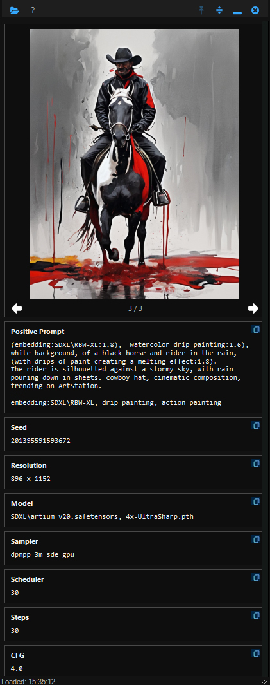

# SIMI-desktop

**Simple Image Metadata Inspector** — a lightweight, portable Windows app for inspecting the embedded metadata of PNG images generated by [ComfyUI](https://github.com/comfyanonymous/ComfyUI).

---
## Features

- **Instant metadata display** — reads ComfyUI workflow data embedded in PNG files and presents it in a clean, readable panel
- **Drag and drop** — drop any ComfyUI PNG onto the app window to load it immediately
- **Folder browsing** — open a folder and navigate through all PNGs in it with the previous/next arrows or keyboard left/right
- **Image preview** — displays the image alongside its metadata
- **Remembers last session** — re-opens the last viewed image automatically on next launch
- **Portable** — no installer, no registry entries; runs from any folder
- **Dark themed** — easy on the eyes in a typical AI image generation workflow
- **Always-on-top / pin** — keep the panel visible while working in other apps
- **Collapse mode** — shrink the panel to just the toolbar when you need the screen space

---
## Screenshots  
  
  
  
---

## Requirements

- Windows 10 or 11
- PowerShell 5.1 (built into Windows — no installation needed)

---

## Installation

1. Download the latest release zip from the [Releases](../../releases) page
2. Extract it anywhere — keeping the `Assets` folder alongside the exe
3. Run `SIMI-desktop.exe`

The folder structure must be preserved:

```
SIMI-desktop.exe
Assets\
  ComfyUI-PNG-Meta.ps1
  Icons\
    (icon files)
```

---

## Usage

| Action | How |
|---|---|
| Open a folder | Click the folder icon in the toolbar |
| Drop a file | Drag any ComfyUI PNG onto the app window |
| Browse images | Left / Right arrow keys, or the nav arrows below the image |
| Pin on top | Click the pin icon |
| Collapse | Click the collapse icon to shrink to toolbar only |
| About | Click the `?` button in the toolbar |

On first launch, the status bar prompts you to choose a folder. After that, the app remembers and re-opens your last image automatically.

---

## Building from Source

The repository contains the PowerShell source and a build script that compiles it to a standalone exe using [PS2EXE](https://github.com/MScholtes/PS2EXE).

**Prerequisites:** Windows, PowerShell 5.1+, internet access (to download PS2EXE on first build)

```powershell
# Right-click Build-Exe.ps1 → Run with PowerShell
# Or from a terminal:
.\Build-Exe.ps1
```

This produces `SIMI-desktop-Portable.zip` — ready to distribute.

If you get an execution policy error:

```powershell
Set-ExecutionPolicy -Scope CurrentUser -ExecutionPolicy RemoteSigned
```

---

## Metadata Fields Displayed

The app extracts and displays whatever ComfyUI embeds in the PNG, typically including:

- Positive and negative prompts
- Seed
- Resolution
- Model / checkpoint
- LoRAs
- Sampler, steps, CFG scale

Fields not present in a given image are shown as `N/A`.

---

## Origin

SIMI-desktop started life as a Directory Opus panel plugin. It was rebuilt as a fully standalone portable app, removing all DOpus dependencies while retaining the same metadata extraction core (`ComfyUI-PNG-Meta.ps1`).

---

## License

MIT — do whatever you like with it.

---

*David McCabe, 2026*
