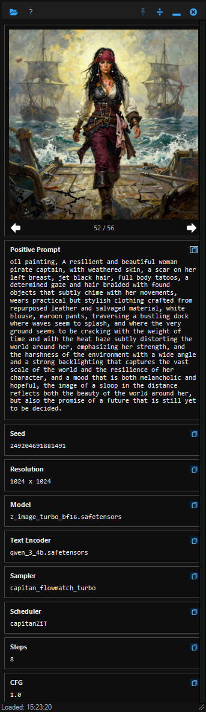
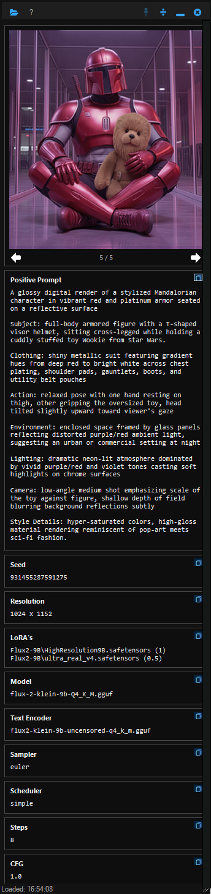
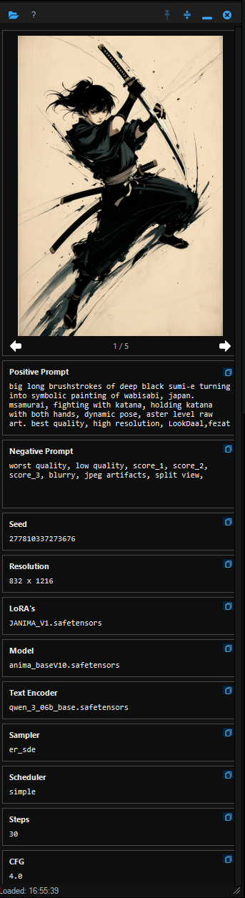

# SIMI-desktop

**Simple Image Metadata Inspector** — a lightweight, portable Windows app for inspecting the embedded metadata of PNG images generated by [ComfyUI](https://github.com/comfyanonymous/ComfyUI).

---

## Disclaimer: 

- This is just a little personal vibe coding project. Drop issues if you want, but I cannot guarantee a fix. I do enough technical support as it is!. 
- All files contained here are '**as is**'. You are more than welcome to drop them into an AI overlord of choice to fix or fork. Just drop me a credit at least.

---
## Features

- **Instant metadata display** — reads ComfyUI workflow data embedded in PNG files and presents it in a clean, readable panel
- **Drag and drop** — drop any ComfyUI PNG onto the app window to load it immediately
- **Folder browsing** — open a folder and navigate through all PNGs in it with the previous/next arrows or keyboard left/right
- **Image preview** — displays the image alongside its metadata
- **Remembers last session** — re-opens the last viewed image automatically on next launch
- **Portable** — no installer, no registry entries; runs from any folder
- **Dark themed** — easy on the eyes in a typical AI image generation workflow
- **Always-on-top / pin** — keep the panel visible while working in other apps
- **Collapse mode** — shrink the panel to just the toolbar when you need the screen space

---
## Screenshots

|                                                     |                                                     |                                                     |                                                     |
| --------------------------------------------------- | --------------------------------------------------- | --------------------------------------------------- | --------------------------------------------------- |
|  |  |  |  |
  
---

## Requirements

- Windows 10 or 11
- PowerShell 5.1 (built into Windows — no installation needed)

---

## Installation

1. Download the latest release zip from the [Releases](../../releases) page
2. Extract it anywhere — keeping the `Assets` folder alongside the exe
3. Run `SIMI-desktop.exe`

The folder structure must be preserved:

```
SIMI-desktop.exe
Assets\
  ComfyUI-PNG-Meta.ps1
  Icons\
    (icon files)
```

---

## Usage

| Action | How |
|---|---|
| Open a folder | Click the folder icon in the toolbar |
| Drop a file | Drag any ComfyUI PNG onto the app window |
| Browse images | Left / Right arrow keys, or the nav arrows below the image |
| Pin on top | Click the pin icon |
| Collapse | Click the collapse icon to shrink to toolbar only |
| About | Click the `?` button in the toolbar |

On first launch, the status bar prompts you to choose a folder. After that, the app remembers and re-opens your last image automatically.

---

## Building from Source

The repository contains the PowerShell source and a build script that compiles it to a standalone exe using [PS2EXE](https://github.com/MScholtes/PS2EXE).

**Prerequisites:** Windows, PowerShell 5.1+, internet access (to download PS2EXE on first build)

```powershell
# Right-click Build-Exe.ps1 → Run with PowerShell
# Or from a terminal:
.\Build-Exe.ps1
```

This produces `SIMI-desktop-Portable.zip` — ready to distribute.

If you get an execution policy error:

```powershell
Set-ExecutionPolicy -Scope CurrentUser -ExecutionPolicy RemoteSigned
```

---

## Metadata Fields Displayed

The app extracts and displays whatever ComfyUI embeds in the PNG, typically including:

- Positive and negative prompts
- Seed
- Resolution
- Model / checkpoint
- LoRAs
- Sampler, steps, CFG scale

Fields not present in a given image are shown as `N/A`, or will describe the error in red text.
**NOTE:** Not all PNG files contain embedded metadata. Please be aware of this before complaining.

---

## Origin

SIMI-desktop started life as a Directory Opus panel plugin. It was rebuilt as a fully standalone portable app, removing all DOpus dependencies while retaining the same metadata extraction core (`ComfyUI-PNG-Meta.ps1`).

---

## Technical Deep Dive for all us Nerds out there

This section covers how `ComfyUI-PNG-Meta.ps1` actually works under the hood — the PNG chunk parsing, the ComfyUI graph resolution strategy, the multi-stage fallback logic, and the edge cases that required non-obvious solutions. If you're just using the app, skip this. If you're extending it, debugging a workflow that produces unexpected output, or just nosy, read on.

---

### How ComfyUI Embeds Metadata in PNG Files

PNG files are structured as a sequence of typed chunks. Each chunk has a 4-byte type tag, a length, a payload, and a CRC. ComfyUI uses the standard ancillary text chunks to embed generation metadata:

| Chunk type | Encoding | Used for |
|---|---|---|
| `tEXt` | Latin-1, uncompressed | Legacy A1111 `parameters` field |
| `zTXt` | Latin-1, zlib-compressed deflate | Older ComfyUI embeds |
| `iTXt` | UTF-8, optionally zlib-compressed | Current ComfyUI `prompt` and `workflow` fields |

`ComfyUI-PNG-Meta.ps1` reads the raw bytes of the file directly — no external image libraries — and walks the chunk list manually, decompressing zlib payloads where needed using .NET's `DeflateStream`. The zlib header (2-byte magic + 4-byte Adler checksum tail) is stripped before handing the payload to `DeflateStream`, which expects raw deflate.

The image resolution is taken directly from the `IHDR` chunk (always the first chunk in any valid PNG) rather than from the workflow JSON, since the IHDR reflects the actual pixel dimensions of the output regardless of what the workflow specified.

---

### The Three Metadata Sources and How They're Merged

A ComfyUI PNG typically contains two relevant text chunks: `prompt` and `workflow`. Older images, or images generated via A1111-compatible frontends, may instead have a `parameters` key. The script attempts to extract fields from all three and merges them with priority ordering:

```
prompt chunk  >  parameters chunk  >  workflow chunk
```

**`prompt` chunk** — a JSON object keyed by node ID. Each node has a `class_type` and an `inputs` map. This is the authoritative source for sampler settings, seed, prompts, model names, and LoRAs. Values can be literals or `[node_id, output_index]` reference arrays pointing to another node's output.

**`workflow` chunk** — the full ComfyUI graph as serialised by the frontend, including node positions, UI widget values, and connection links. This is used as a fallback when the prompt chunk is missing fields or when widget values weren't serialised into the prompt's `inputs` map (which happens with some custom nodes).

**`parameters` chunk** — a plain-text A1111-style block in the format `positive prompt\nNegative prompt: ...\nSteps: N, Sampler: ...`. Parsed with a key-value regex over the metadata line starting at `Steps:`.

---

### Prompt Chunk: Node Graph Resolution

The core challenge with the `prompt` chunk is that values are frequently not inline literals — they're references to other nodes. A `KSampler`'s `seed` might be `[42, 0]`, meaning "take output 0 from node 42", which is a `RandomNoise` node whose own `noise_seed` is `849302847392`.

`Resolve-ComfyValue` handles this recursively (depth-capped at 6 to prevent cycles). When it encounters a reference array, it fetches that node, searches its `inputs` for any of the preferred keys, and recurses if those are also references. If no preferred key resolves to a literal, it falls back to `widgets_values` — the array of UI widget states, which can yield a value even when a node's `inputs` map is sparse.

#### Sampler Node Detection

The primary sampler is detected by class name match against `KSampler`, `SamplerCustom`, and `SamplerAdvanced`. When none of those match — which happens with compact all-in-one custom panels — a second pass finds any node that has both a `positive` and a `negative` input wired as node references. This catches panels like `AngeloSliderLoraLite` that bundle the sampler, scheduler, and conditioning connections into a single node.

For `SamplerCustomAdvanced`-style workflows where the sampler delegates conditioning through a separate guider node (`CFGGuider` or `BasicGuider`), the script follows the `guider` reference one level and extracts `positive`/`negative` from there. `BasicGuider` uses a single `conditioning` input (FLUX-style, no negative) — in that case only the positive prompt is resolved, and the negative prompt field is left blank rather than fabricated.

#### Positive and Negative Prompt Extraction

Once the sampler node is found, `Collect-TextsFromNode` walks the conditioning chain from the `positive` and `negative` refs respectively. It looks for literal string values in the keys `text`, `text_g`, `text_l`, `prompt`, `positive`, `negative` at each node. If none are found as literals (i.e. the node is a conditioning passthrough), it recurses into all ref-type inputs. A shared `$Seen` hashtable prevents loops and ensures a node isn't visited twice within a single collection pass. The positive and negative chains each get their own `$Seen` instance so shared conditioning ancestors don't get omitted from one side.

As a last resort — only reached when the sampler is genuinely absent from the prompt chunk — all `CLIPTextEncode` nodes are collected into the positive prompt field. This handles unusual workflows like img2img with a single text encoder, but is deliberately the final fallback rather than the primary strategy.

---

### Workflow Chunk: Widget Value Heuristics

When the prompt chunk is missing sampler fields (seed, steps, CFG, sampler name, scheduler), `Fill-CoreFieldsFromWorkflowWidgets` scans the workflow's node list.

For standard `KSampler` nodes, widgets are stored in a well-known order: `[seed, control_after_generate, steps, cfg, sampler_name, scheduler, denoise]`. The script reads these by position.

For everything else, it uses two heuristics:

1. **Named widget map** — some nodes export a `widget_defs` or `widgets` array alongside `widgets_values` that names each widget slot. If present, the script matches slots by name.

2. **Value-shape scanning** — if no named map exists, the script scans `widgets_values` for strings matching known sampler names (`Is-KnownSamplerName`) and scheduler names (`Is-KnownSchedulerName`). Once those anchors are located, numeric values after them are interpreted as steps and CFG in order, with a denoise-skip heuristic (a value between 0 and 1 immediately following the scheduler index is treated as denoise, not steps).

Sampler and scheduler name lists cover all current ComfyUI built-ins:

- **Samplers:** `euler`, `euler_ancestral`, `heun`, `heunpp2`, `dpm_*`, `dpmpp_*`, `lms`, `ddim`, `uni_pc`, `lcm`, `ipndm`, `deis`, `ddpm`, `restart`, `res_*`, `sa_solver`, `gradient_estimation`, `tcd`, `ttm_jvp`
- **Schedulers:** `normal`, `karras`, `exponential`, `sgm_uniform`, `simple`, `ddim_uniform`, `beta`, `linear_quadratic`, `kl_optimal`, `turbo`, `ays`, `gits`, `polyexponential`, `vp`, `linear`, `cosine`, `laplace`, `discrete_flow`

---

### Model and Text Encoder Detection

#### Model / Checkpoint

Nodes are matched against a class name regex covering standard and major third-party loaders:

```
CheckpointLoader, UNETLoader, UnetLoader, DiffusionModelLoader, ModelLoader,
Nunchaku, GGUF, HunyuanVideo, CogVideo, WanVideo, Wan2, Mochi, AuraFlow,
LTXVideo, LTXV, HiDream, StableCascade
```

Keys searched within matched nodes: `ckpt_name`, `unet_name`, `model_name`, `diffusion_model`, `gguf_name`, `base_model_name`, `checkpoint_name`, `model`, `vae_name`.

If nothing is found via class name matching, a key-based fallback scans all remaining nodes (excluding known non-model loaders like `VAELoader`, `CLIPLoader`, `LoraLoader`, `ControlNetLoader`) for any of the above keys whose value carries a model file extension (`.safetensors`, `.gguf`, `.pt`, `.pth`, `.ckpt`, `.bin`). The extension requirement is the guard that prevents LoRA filenames from leaking into this field.

#### Text Encoder / CLIP

Same two-stage pattern. Primary class regex:

```
CLIPLoader, DualCLIPLoader, TripleCLIPLoader, QuadrupleCLIPLoader,
TextEncoder, T5, UMT5, BERT
```

`CLIPLoader` as a prefix already catches `CLIPLoaderGGUF`. `TextEncoder` catches `HunyuanVideoTextEncoderLoader`, `NunchakuTextEncoder`, etc.

Keys searched: `clip_name`, `clip_name1`–`clip_name4`, `t5_name`, `bert_name`, `text_encoder_name`, `tokenizer_name`, `te_name`, `vision_encoder_name`.

The fallback considers any node whose class contains `Loader`, `Encoder`, `CLIP`, `TextModel`, or `Tokenizer` and has one of the above keys — excluding checkpoint, VAE, LoRA, ControlNet, IPAdapter, and image/video loaders to avoid false positives.

---

### LoRA Detection

LoRA detection operates in two passes over both the prompt and workflow chunks.

**Pass 1 — targeted custom stackers.** Two node families get special handling because their structure doesn't follow the standard `LoraLoader` pattern:

- **rgthree Power LoRA Loader** — stores each LoRA slot as a structured object with `.lora`, `.on`, `strength_model`, and `strength_clip` fields. The script iterates these objects and skips any where the enabled/on state resolves to false.
- **NO8D Slider LoRA Stack** — serialises its enabled rows as a `stack_json` string (a JSON array with `name`, `weight`, and `enabled` fields) embedded within the node's inputs. The script parses this JSON directly rather than relying on widget scanning, which would also pick up the sampler parameters from the attached lite sampler panel and misidentify `euler` as a LoRA name.

**Pass 2 — standard and generic loaders.** Nodes whose class name contains `lora`, `lyco`, `lycoris`, `stacker`, `power.*loader`, `rgthree`, `efficiency`, `easy`, or `impact` are scanned for input keys that look like LoRA names. Strengths are resolved by looking for `strength_model`, `strength_clip`, and similar keys with a suffix-matching strategy (e.g. `strength_model_1` pairs with `lora_name_1`).

A shared guard function `Is-KnownNonLoraToken` prevents sampler names, scheduler names, boolean strings, colour hex codes, and ComfyUI type labels from leaking into the LoRA list regardless of which detection path surfaces them.

---

### Output Modes

`ComfyUI-PNG-Meta.ps1` is a standalone script that can be called directly. It supports five output modes via the `-Output` parameter:

| Mode | Description | Typical use |
|---|---|---|
| `Html` (default) | Writes an HTML report to `%TEMP%\ComfyUI-Opus-Metadata\` and returns the path | SIMI-desktop UI |
| `Text` | Plain `Key: Value` lines to stdout | Clipboard copy, scripting |
| `Json` | Full parsed metadata object as JSON | Piping to other tools |
| `Field` | Single field value to stdout | Directory Opus column scripts |
| `Dump` | Raw chunk payloads + parsed result as JSON | Debugging |

The `Field` mode accepts friendly aliases: `positive`, `negative`, `seed`, `resolution`, `loras`, `model`, `clip`, `sampler`, `scheduler`, `steps`, `cfg`. LoRA values are flattened to a comma-separated string in this mode rather than newline-separated, for use in single-line column contexts.

```powershell
# Examples
.\ComfyUI-PNG-Meta.ps1 "C:\images\output.png" -Output Text
.\ComfyUI-PNG-Meta.ps1 "C:\images\output.png" -Output Field -Field seed
.\ComfyUI-PNG-Meta.ps1 "C:\images\output.png" -Output Json | ConvertFrom-Json
.\ComfyUI-PNG-Meta.ps1 "C:\images\output.png" -Output Dump  # raw chunk inspection
```

---

### A Note on Custom Nodes

The ComfyUI ecosystem has hundreds of custom node packs, and new ones appear constantly. The detection logic is deliberately layered — class-name regex first, then key-name fallback, then value-shape heuristics — precisely so that workflows using novel node types degrade gracefully to partial results rather than failing outright or misattributing values.

If you find a workflow where a field shows `N/A` but the data is clearly in the file, running with `-Output Dump` will show you the raw `prompt` and `workflow` JSON, which makes it straightforward to identify the node class and input key names involved and add them to the appropriate detection path.

---

## License

MIT - do whatever you like with it, but at least write me a credit somewhere

---

*David McCabe, 2026*
